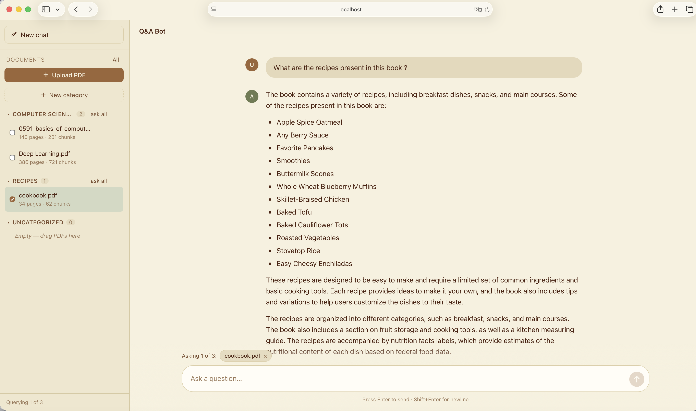

# PDF Q&A Bot

A document question-answering application. Upload one or more PDFs and ask
questions about them in a chat interface. Answers are generated using
retrieval-augmented generation (RAG): the relevant passages are retrieved from
the documents and passed to a large language model, which streams its response
back token by token. The bot keeps conversational context, so follow-up
questions like "how does it work?" are understood in the context of the
previous turns.



## Features

- Upload and manage multiple PDF documents.
- Ask questions in natural language and receive streamed, well-developed answers.
- Conversational memory: follow-up questions are rewritten into standalone
  questions before retrieval, so references such as "it" or "that one" resolve
  correctly.
- Scope a question to specific documents by selecting them in the sidebar.
- Automatic chapter detection: a question mentioning "chapter N" is filtered to
  that chapter.
- Duplicate uploads are detected by content hash and skipped.
- Persistent vector store, so indexed documents survive restarts.

## Architecture

| Layer       | Technology                                                        |
| ----------- | ----------------------------------------------------------------- |
| Frontend    | React 18, TypeScript, Vite                                        |
| Backend     | FastAPI, server-sent events for streaming                         |
| RAG         | LangChain                                                         |
| LLM         | Groq, `llama-3.3-70b-versatile`                                   |
| Embeddings  | HuggingFace `BAAI/bge-small-en-v1.5` (runs locally on CPU)        |
| Vector store| Chroma (persisted to disk)                                        |
| PDF parsing | pypdf via LangChain's `PyPDFLoader`                               |

How a question is answered:

1. If there is prior conversation, the follow-up question is condensed into a
   standalone question.
2. The standalone question is embedded and used to retrieve the most relevant
   chunks from Chroma.
3. The retrieved context, the conversation history, and the question are sent to
   the LLM, which streams the answer back to the browser.

## Project structure

```
.
├── backend/
│   ├── api.py             # FastAPI app and HTTP/streaming endpoints
│   ├── document_store.py  # Persistent document + vector store (Chroma)
│   ├── ingestion.py       # PDF loading, chapter tagging, chunking
│   └── rag_engine.py      # Retrieval + condense + answer chain
├── frontend/
│   └── src/               # React + TypeScript UI
├── data/                  # Runtime data (created automatically, not committed)
│   ├── chroma_db/         # Vector index
│   ├── uploads/           # Original uploaded PDFs
│   └── documents.json     # Document metadata
├── requirements.txt
└── README.md
```

## Run with Docker (recommended)

The whole app (frontend + backend) ships as a single container that serves the
UI and the API on one port. You only need Docker and a Groq API key — no Python
or Node.js on your machine.

```bash
# Build the image
docker build -t qna-bot .

# Run it (replace with your key from https://console.groq.com)
docker run -p 8000:8000 -e GROQ_API_KEY=your_groq_api_key qna-bot
```

Then open http://localhost:8000 in your browser.

To keep your uploaded PDFs and index between runs, mount a volume for `/app/data`:

```bash
docker run -p 8000:8000 -e GROQ_API_KEY=your_groq_api_key \
  -v qna_data:/app/data qna-bot
```

### Docker Compose

Alternatively, put `GROQ_API_KEY=your_groq_api_key` in a `.env` file next to
`docker-compose.yml`, then:

```bash
docker compose up --build
```

Compose already wires up the port, the API key, and a named volume for
persistence. The app is available at http://localhost:8000.

> The image pre-downloads the embedding model at build time, so the first
> question is fast. The build is larger as a result but needs no network at
> runtime beyond calls to the Groq API.

## Run locally (development)

Use this if you want hot-reloading while working on the code. Prerequisites:

- Python 3.11 or newer (developed on 3.13).
- Node.js 18 or newer.
- A Groq API key (free at https://console.groq.com).

### 1. Configure environment variables

Create a `.env` file in the project root:

```
GROQ_API_KEY=your_groq_api_key
```

Optional variables:

- `HF_TOKEN` — a HuggingFace token. Not required for the default embedding
  model, which is public; only useful if you hit download rate limits.
- `LANGSMITH_TRACING`, `LANGSMITH_API_KEY`, `LANGSMITH_PROJECT` — enable
  LangSmith tracing if you want to inspect the chains.

### 2. Backend

From the project root:

```bash
python3 -m venv .venv
source .venv/bin/activate
pip install -r requirements.txt
uvicorn backend.api:app --reload --port 8000
```

The first run downloads the embedding model (a few hundred megabytes), so it
may take a moment.

### 3. Frontend

In a second terminal:

```bash
cd frontend
npm install
npm run dev
```

Open http://localhost:5173 in your browser. The Vite dev server proxies API
requests to the backend on port 8000, so both must be running.

## Usage

1. Click "Upload PDF" in the sidebar and select a document. It will be parsed,
   chunked, and indexed.
2. Optionally select one or more documents to scope your questions to them. With
   nothing selected, all documents are searched.
3. Type a question and press Enter. The answer streams in.
4. Ask follow-up questions; the bot remembers the conversation.
5. Use "New chat" to clear the conversation. Your uploaded documents remain
   indexed.

## API reference

The backend exposes the following endpoints:

| Method | Path                    | Description                                  |
| ------ | ----------------------- | -------------------------------------------- |
| GET    | `/api/health`           | Health check.                                |
| GET    | `/api/documents`        | List indexed documents.                      |
| POST   | `/api/documents`        | Upload a PDF (multipart form, field `file`). |
| DELETE | `/api/documents/{id}`   | Delete a document and its vectors.           |
| POST   | `/api/ask`              | Ask a question; streams the answer as SSE.   |

## Configuration

A few constants can be tuned in the backend:

- `DEFAULT_K` in `backend/rag_engine.py` — number of chunks retrieved per
  question (default 6). Increasing it gives the model more material to draw on.
- `HISTORY_WINDOW` in `backend/rag_engine.py` — number of recent messages kept
  as conversational context (default 8).
- `CHUNK_SIZE` and `CHUNK_OVERLAP` in `backend/ingestion.py` — controls how
  documents are split.
- `EMBEDDING_MODEL` in `backend/document_store.py` — the embedding model.
  Changing it requires deleting `data/chroma_db` and re-indexing, since vectors
  from different models are not comparable.

## Notes

- Only text-based PDFs are supported. Scanned/image-only PDFs produce no
  extractable text and will be rejected.
- The vector index and uploaded files in `data/` are generated at runtime and
  are not part of the repository.
